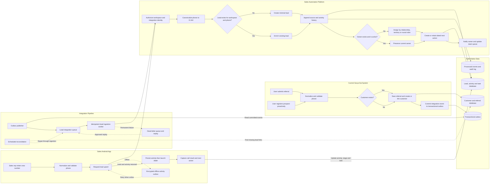
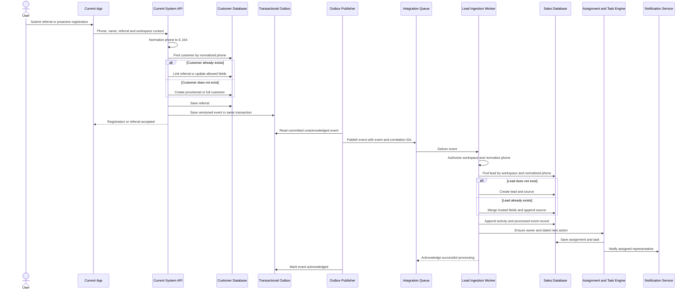
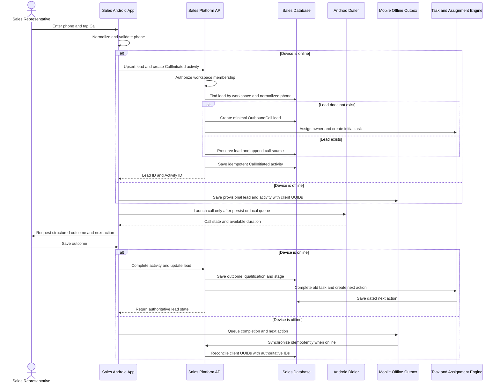
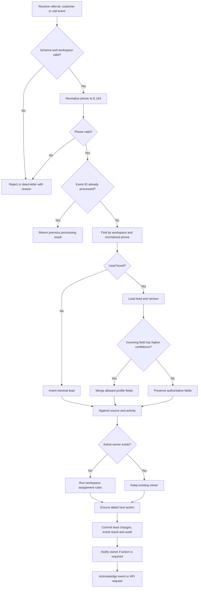
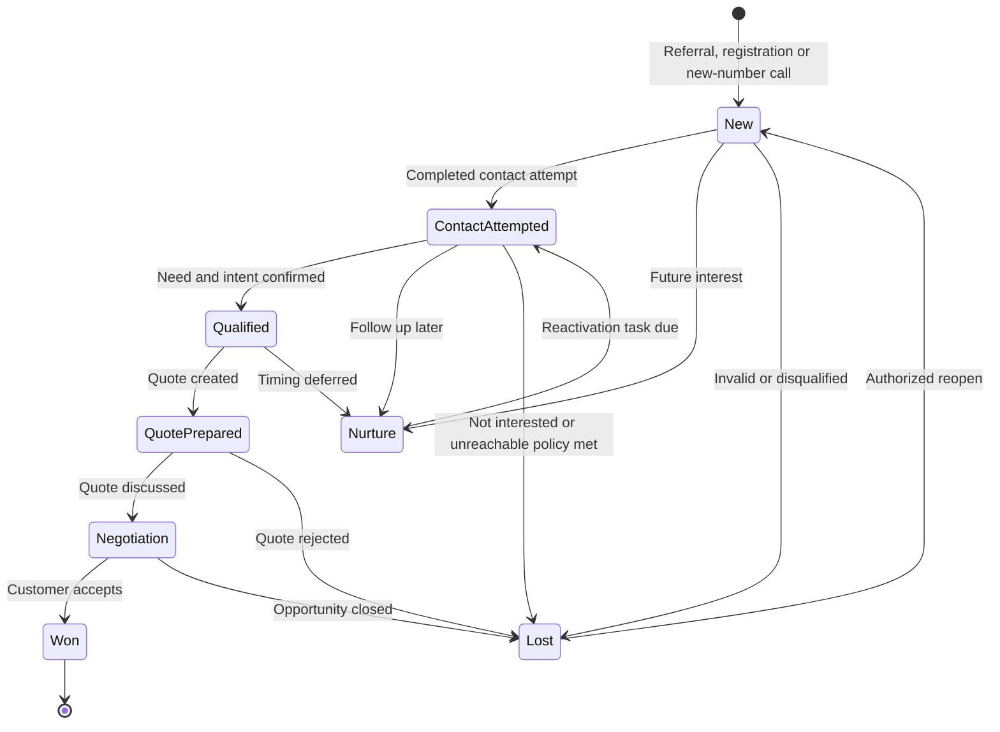
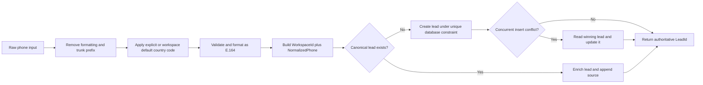
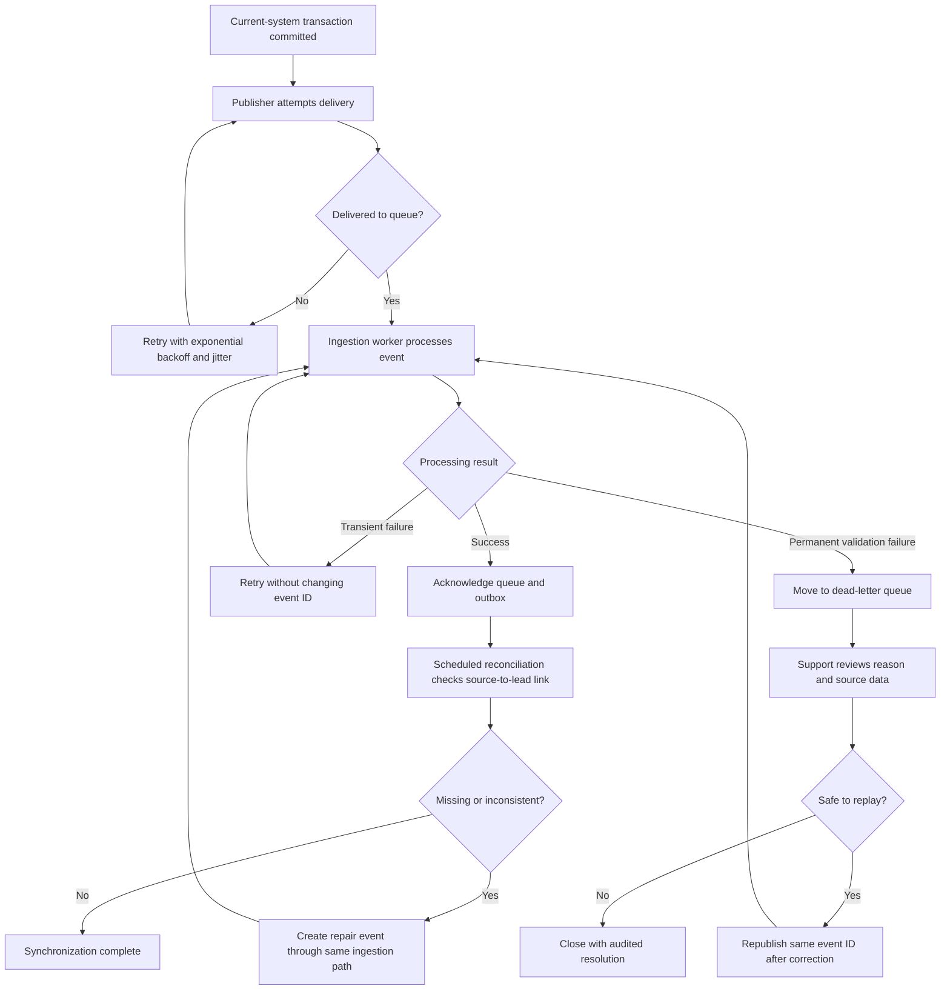

# Lead Creation and Synchronization Workflows

**Status**: Proposed for evaluation  
**Date**: 2026-08-19  
**Implementation plan**: [lead-creation-plan.md](lead-creation-plan.md)
**Rendered overview**: [lead-creation-workflow.svg](lead-creation-workflow.svg)  
**Editable Mermaid source**: [lead-creation-workflow.mmd](lead-creation-workflow.mmd)

## 1. Complete End-to-End Workflow

## 2. Referral and Proactive Registration Sequence

## 3. New-Number Outbound Call Sequence

## 4. Lead Upsert Decision Flow

## 5. Lead State Workflow

## 6. Phone Identity and Deduplication

## 7. Operational Failure and Recovery Flow

## 8. Important Behavioral Rules

- The canonical lead identity is `(WorkspaceId, NormalizedPhoneNumber)`.
- Referral, registration, and call paths always use the same lead-upsert service.
- A second source enriches a lead; it does not create another lead.
- Existing owner and advanced stage are preserved unless an explicit authorized rule changes them.
- A new-number call creates or locally queues the lead before opening the dialer.
- Every active lead is assigned or visible in the workspace's unassigned queue.
- Every active lead has a dated next action.
- Integration event and mobile activity IDs make every retry idempotent.
- Failures are retried, dead-lettered, replayable, audited, and reconciled.

